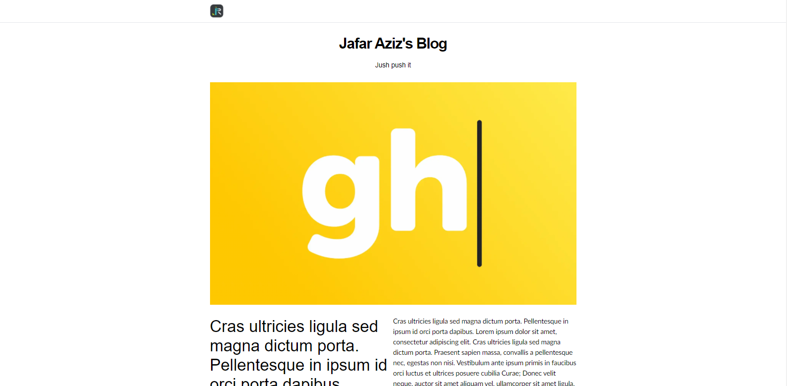

# Super Simple Next Js + Ghost Blog



This is just simple Next.js blog+Ghost API. You can use for your blog and deploy to vercel or your custom next server. Here the [demo](https://blog-jfraziz.vercel.app/). If you wanna use this template, don't forget to add some `environment variables` below

| env               | value                                                                                     |     \*     |
| ----------------- | :---------------------------------------------------------------------------------------- | :--------: |
| GHOST_API_URL     | your ghost blog url (`https://example.com`)                                                     | `required` |
| GHOST_API_KEY     | api key for your ghost blog, you can create custom integration for this                   | `required` |
| GHOST_API_VERSION | ghos api version, default is `v3` you can use another version                             | `optional` |
| IMAGE_DOMAINS     | comma separated domain url for your image, `example.com,cms.example.com`                  | `required` |
| SITE_URL          | your blog domain if you using custom domain, default is your `vercel url` of yoru project | `optional` |

### Features

This template has some features :

- [x] Full SEO, you have `robots.txt`, `sitemap.xml` autogenerated
- [x] Simple, Minimalistic, and 🚀 Fast
- [x] You can embed any script or iframe to your blog like `github gist`, `codepen` , `zapier`, `yputube`, and others
- [x] Optimized Image, yeah this template use `Next.js` `Image` component
- [x] Infinite Scroll for your homepage, this template use infinite scroll instead pagination.
- [ ] Dark Mode
- [ ] Tags
- [ ] Comment System
- [ ] Subscription Menu

Some features may be not implemented yet, and will be implemented soon.

### Install

You can install to your vercel account by simply clicking button below

[](https://vercel.com/new/clone?repository-url=https%3A%2F%2Fgithub.com%2FJfrAziz%2Fnext-ghost-template&env=GHOST_API_URL,GHOST_API_KEY,IMAGE_DOMAINS&project-name=next-js-ghost-blog&repository-name=ghost-blog)

or you can run this project by using this command

```bash
git clone https://github.com/JfrAziz/next-ghost-template.git

cd next-ghost-template

npm install

npm run dev
```

### Note

If you wanna add some features from this template, feel free to fork or add pull request 😅😅